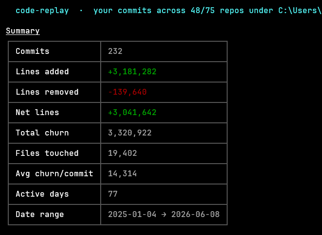
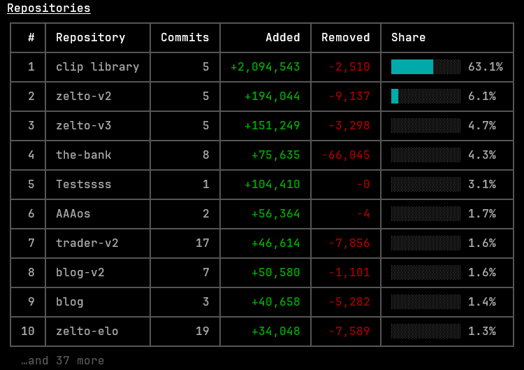
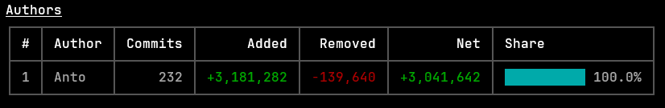
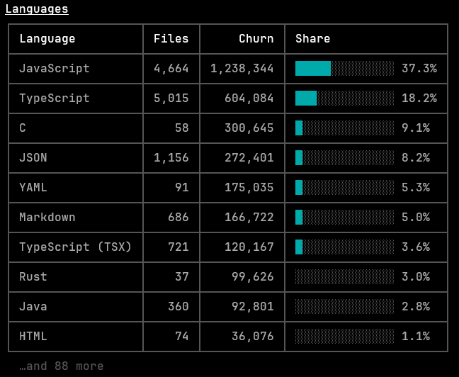
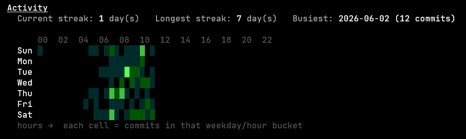

# code-replay

> Terminal tool that replays your local **git** history and tells you what you actually shipped: lines added / removed / changed, who committed, which languages, and when you were active.

### [Github Repo](https://github.com/MRMCBlob/code-replay)

No accounts, no tokens, no network. It only reads the local git repo in front of you.

**By default it shows only _your_ commits** — where you are the author or a `Co-authored-by` co-author, based on your `git config user.name` / `user.email`. Use `--everyone` to include all authors.

 

## Preview:
### Summary


### Repositories:


### Authors:


### Languages:


### Activity:


## Install

```bash
# global, run anywhere
npm install -g code-replay
# or pnpm
pnpm add -g code-replay
```

Or run without installing:

```bash
npx code-replay
```

## Usage

Run inside any git repository:

```bash
code-replay          # analyze the current repo
cr                   # short alias
code-replay ../other-project
```

### Analyze every repo on your machine

```bash
code-replay --all                       # scan your home folder for repos
code-replay --all --root D:\code        # scan a specific folder
code-replay --all --author you          # your commits across all repos
```

`--all` walks the scan root (default: your home directory), finds every git repo,
merges all their commits, and adds a **Repositories** table ranking them by churn.
It skips `node_modules`, build folders and OS system dirs, and stops descending once
it hits a repo. Tune the crawl with `--root <path>` and `--depth <n>`.

Because the default already filters to you, repos you only cloned (and never
committed/co-authored to) contribute nothing and are dropped from the results —
so `--all` effectively shows just the repos you actually worked on. Add
`--everyone` to include every author in every repo instead.

#### Caching

The discovered repo list is cached to disk (`~/.code-replay/repos-cache.json`,
or `$XDG_CACHE_HOME/code-replay/`) and **survives reboots**, so repeat `--all` runs
skip the filesystem crawl. Cached entries are validated (repos that no longer exist
are pruned) and expire after `--cache-ttl` hours (default 168 = 1 week).

```bash
code-replay --all --refresh        # force a fresh scan, then update the cache
code-replay --all --no-cache       # ignore the cache for this run
code-replay --all --cache-ttl 24   # treat cache older than 24h as stale
code-replay --clear-cache          # delete the cache file and exit
```

It prints four sections:

- **Summary** — commits, lines added/removed, net, churn, files touched, active days, date range.
- **Authors** — per-author commits, added/removed, net, and share of total churn.
- **Languages** — churn grouped by language/file type with proportion bars.
- **Activity** — current & longest commit streaks, busiest day, and a weekday × hour heatmap.

### Options

| Flag | Description |
| --- | --- |
| `[repo]` | Path to the repo (default: `.`) |
| `--since <date>` | Only commits after a date, e.g. `--since "2 weeks ago"` |
| `--until <date>` | Only commits before a date |
| `--author <pattern>` | Filter by a specific author (overrides the default 'me' filter) |
| `--everyone` | Include all authors, not just you |
| `--pathspec <path>` | Restrict to a subdirectory or file |
| `--top <n>` | Max rows in author/language/repo tables (default `10`) |
| `--all` | Scan every git repo on the machine and aggregate them |
| `--root <path>` | With `--all`: folder to scan (default: home) |
| `--depth <n>` | With `--all`: max folder depth to scan (default `7`) |
| `--no-cache` | With `--all`: ignore the cached repo list |
| `--refresh` | With `--all`: force a fresh filesystem scan |
| `--cache-ttl <hours>` | With `--all`: cache lifetime in hours (default `168`) |
| `--clear-cache` | Delete the cached repo list and exit |
| `--no-color` | Disable colored output |
| `--version`, `--help` | Standard info |

Examples:

```bash
code-replay --since "1 month ago" --top 5
code-replay --author alice --pathspec src/
```

## Use as a library

```ts
import { getCommits, computeTotals, computeLanguages } from "code-replay";

const commits = await getCommits({ cwd: process.cwd() });
console.log(computeTotals(commits));
console.log(computeLanguages(commits));
```

## How it works

`code-replay` shells out to your installed `git` and runs a single
`git log --no-merges --numstat` with a machine-readable pretty format, then parses
and aggregates the output in pure, unit-tested functions. Binary files are detected
(git reports `-` line counts) and excluded from line totals.

## Develop

```bash
pnpm install
pnpm build      # bundle to dist/ via tsup
pnpm test       # vitest
pnpm typecheck
node dist/cli.js .
```

## License

MIT
